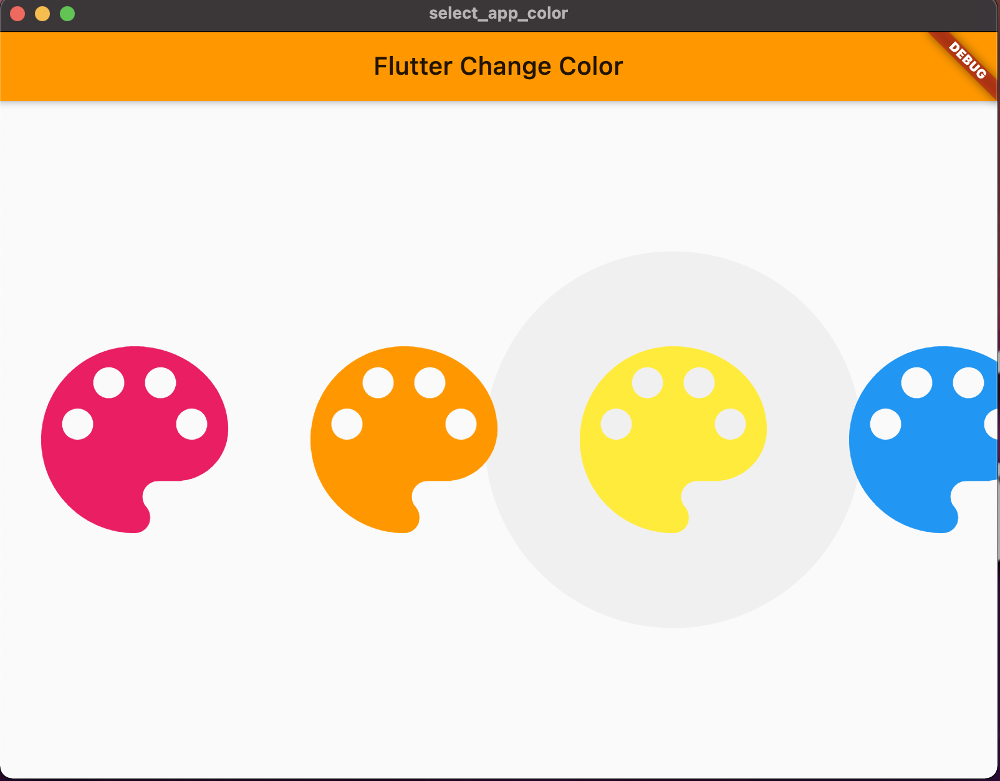
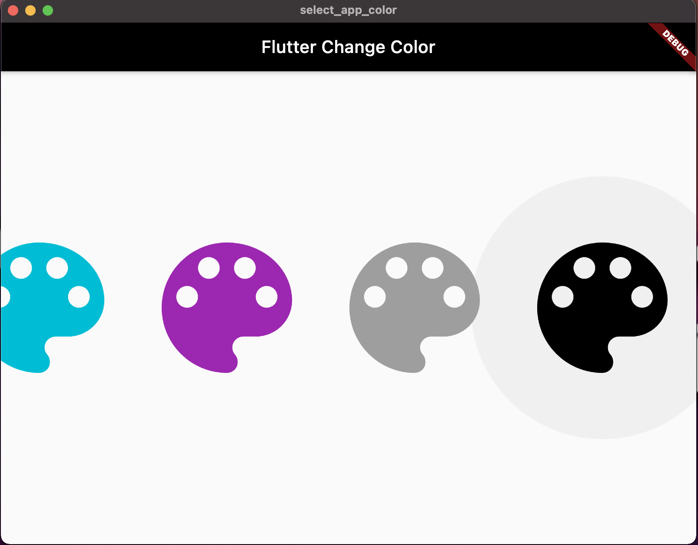
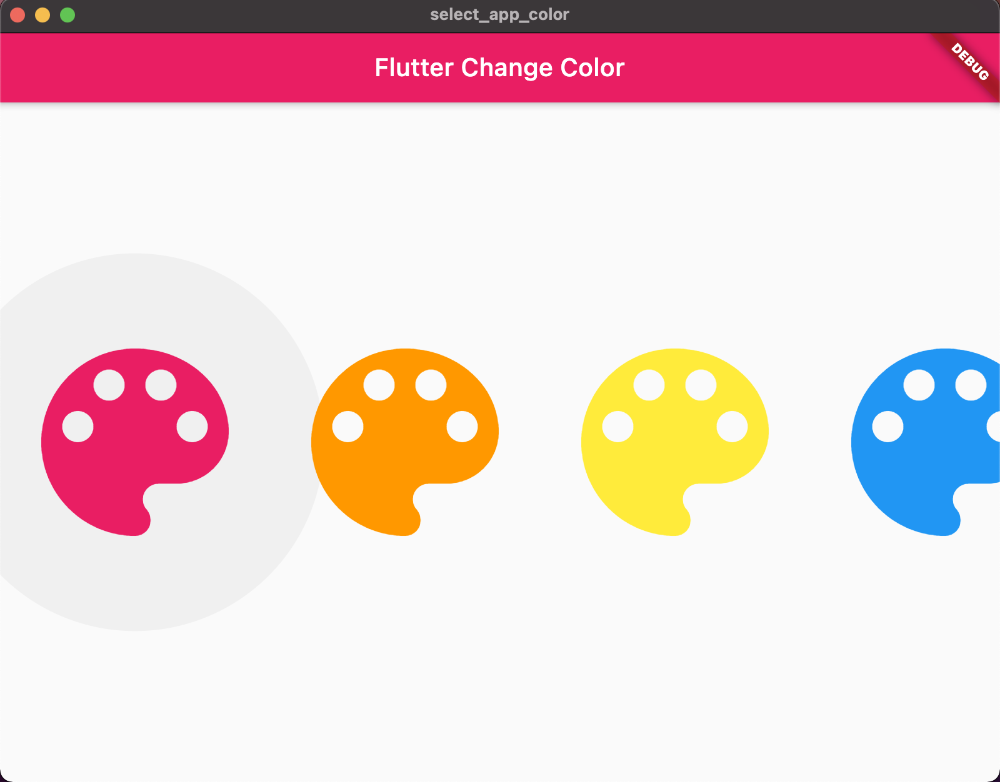

# App that Allow Change Colors Dinamically

In the main is used a StreamBuilder<MaterialColor>

    ...
    StreamController<MaterialColor> isLightTheme = StreamController();
    class MyApp extends StatelessWidget {
      @override
      Widget build(BuildContext context) {
        return StreamBuilder<MaterialColor>(
            initialData: Colors.blue,
            stream: isLightTheme.stream,
            builder: (context, snapshot) {
              return MaterialApp(
                title: 'FACTEC',
                theme: ThemeData(
                  primarySwatch: snapshot.data,
                  visualDensity: VisualDensity.adaptivePlatformDensity,
                ),
                home: MyHomePage(title: 'Flutter Change Color'),
              );
            });
      }
    }
    ...
    
## List of App Colors

The widget is called using 

    child: ListBtnsAppColors()

The "ListBtnsAppColors()" use material colors ubicated in "listBtnsAppColors.dart" and a new material black color localized inside "colors.dart".

